# Smart Home Automation System with gRPC (TypeScript)

Welcome to the Smart Home Automation System project! This project aims to create a smart home automation system using gRPC for communication, allowing users to control and monitor devices such as lights, thermostats, and security cameras remotely.

## AuthService

The Auth Service handles user authentication and authorization. Methods:

- POST: `/auth/register` register user with correct credentials
- POST: `/auth/login` login to account
- **(available internally with grpc authService)** verifyToken: verify login user token

## HouseService

The House Service manage house data. Methods:

- POST: `/house` add your house
- PUT: `/house/:<ID>` update house data
- DELETE: `/house/:<ID>` remove your house data
- GET: `/house/:<ID>` see house status

## ThingService

The Thing Service manage and do interaction with things. Methods:

- Post: `/thing` add your thing to your house
- PUT: `/thing/:<ID>` update your thing data(just information)
- DELETE: `/thing/:<ID>` delete thing
- GET `/thing/:<ID>` get information about thing
- PATCH `/thing/:<ID>` have interaction with your thing here
  - turn on
  - turn off
  - change mode
  - increase level
  - decrease level

# Demo

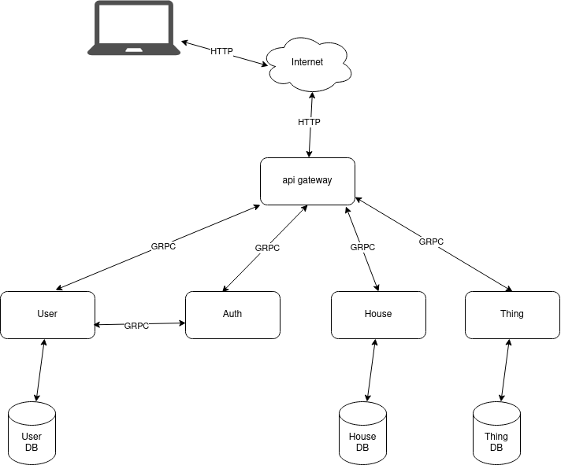

- http requests from apigateway
  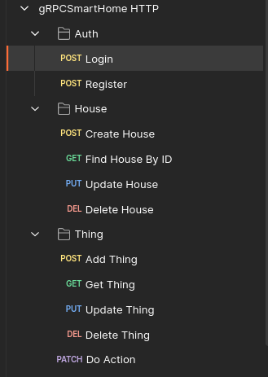
- grpc methods
  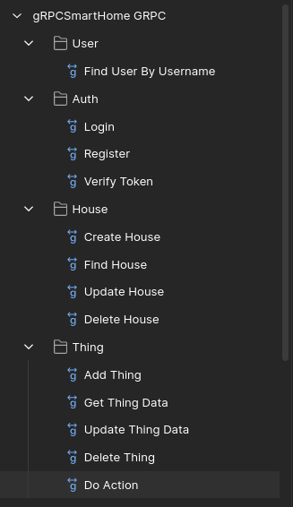

- auth
  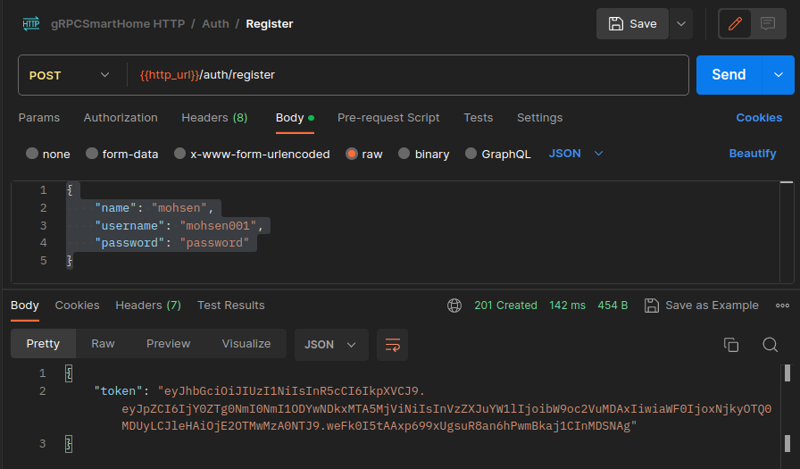
  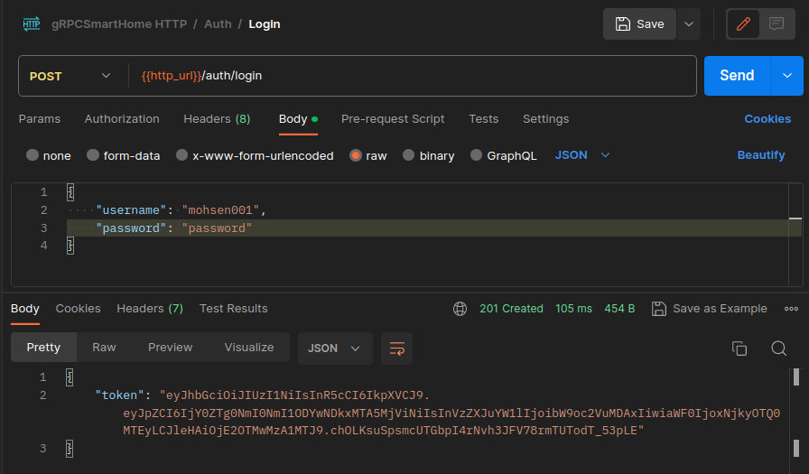
  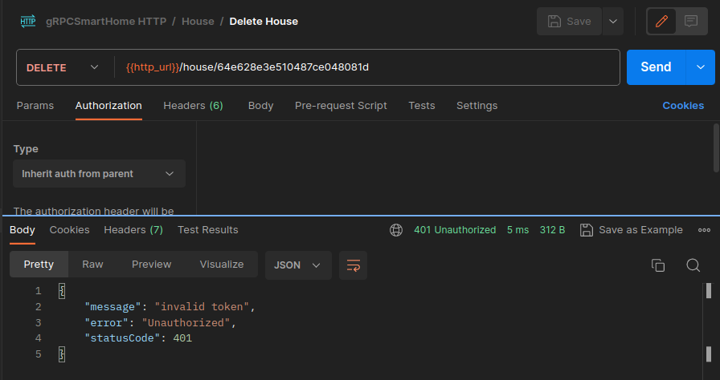
- house
  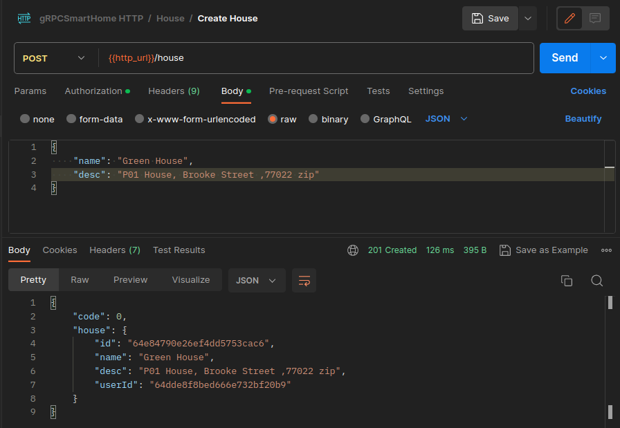
  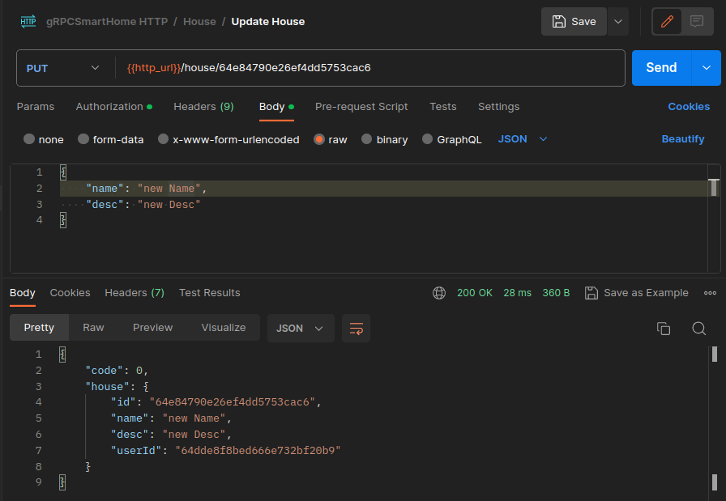
  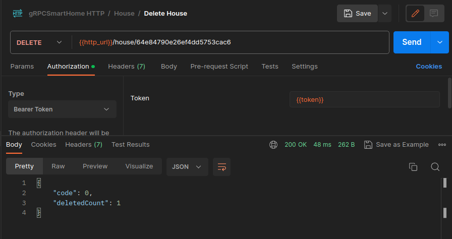
  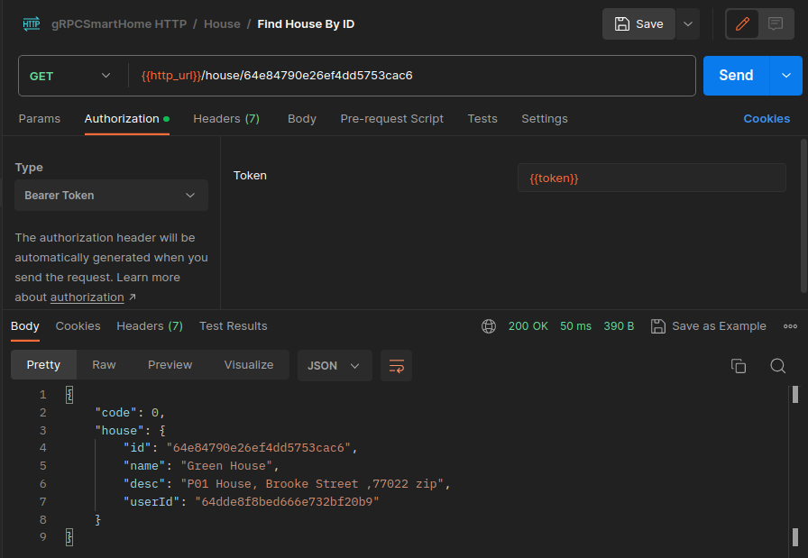
- thing
  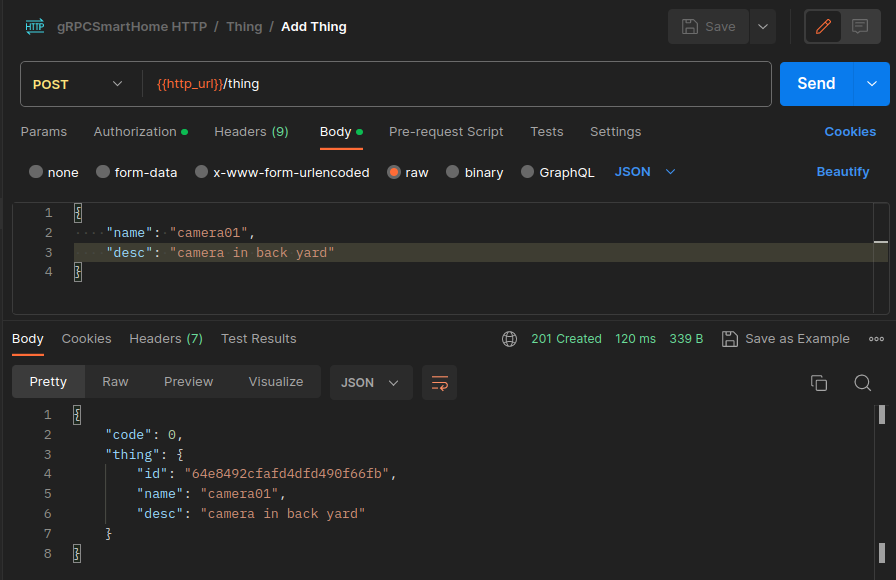
  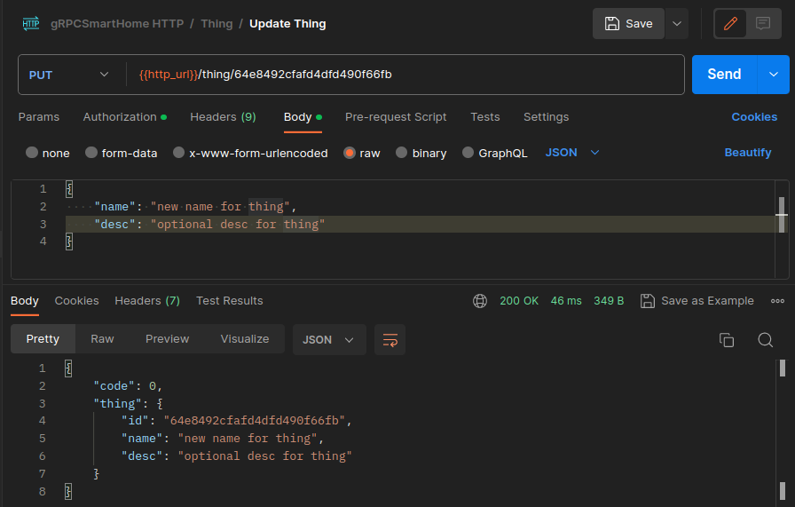
  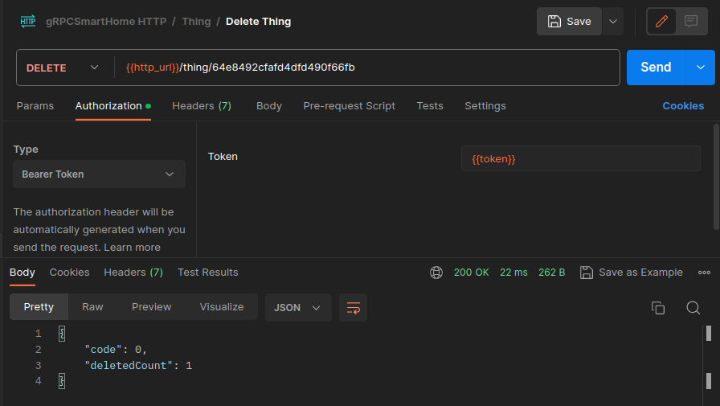
  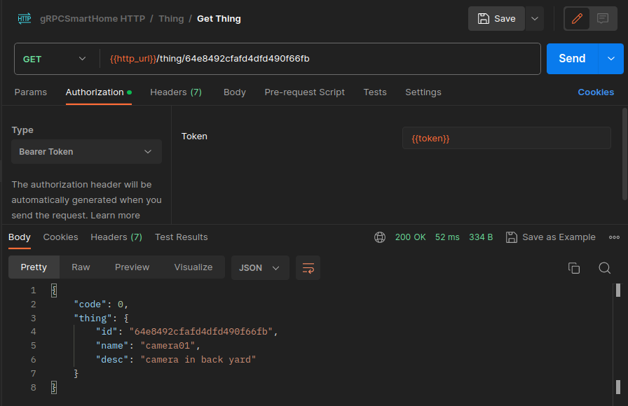
  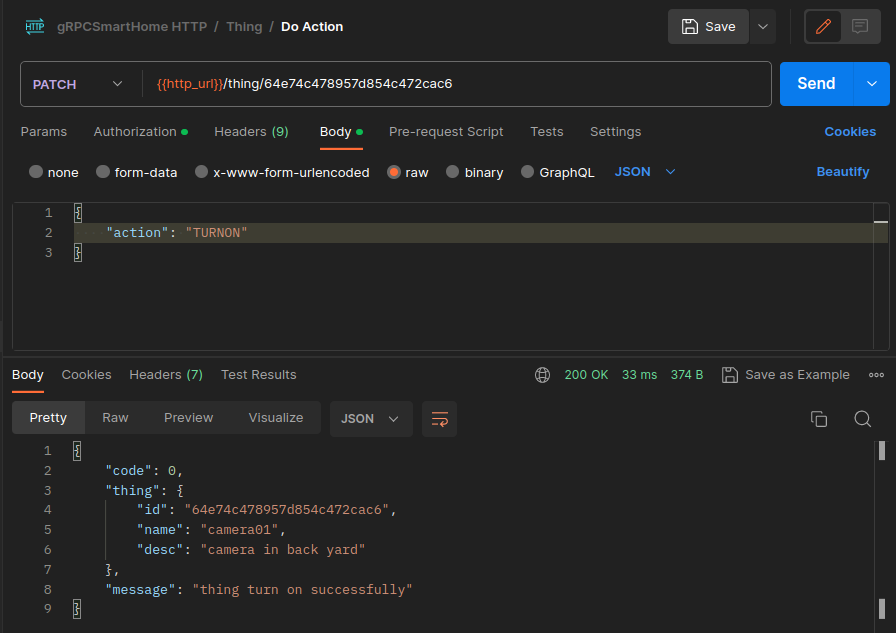
  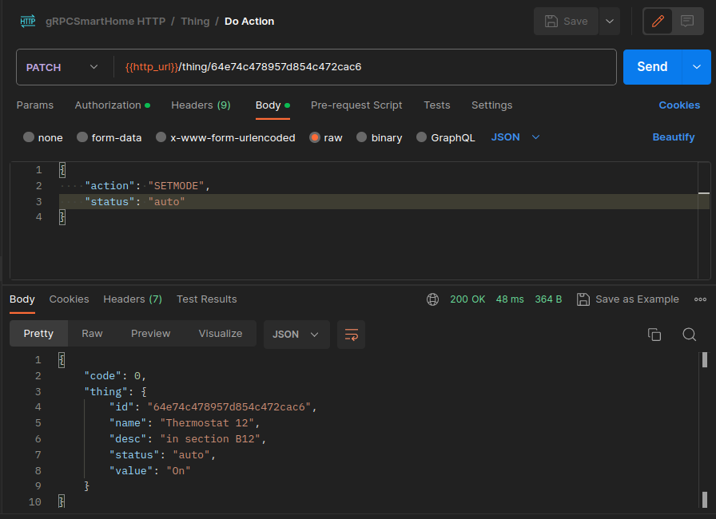

## Features

- Control lights: Turn on/off lights remotely.
- Adjust thermostat: Set thermostat temperature remotely.
- Monitor security cameras: Access camera feeds remotely.

## Getting Started

### Prerequisites

- Node.js (v16 or higher)
- npm (Node Package Manager)

### Installation

**Clone the repository:**

```bash
git clone https://github.com/BaseMax/gRPCSmartHome.git
cd gRPCSmartHome
```

**Install dependencies:**

````bash
# Server
npm install

## Usage
**Start the server:**

```bash
# Inside the server directory
npm start:dev user
npm start:dev auth
npm start:dev house
npm start:dev thing
npm start:dev apigateway
````

## Functionality

### 1. Control Lights

Users can remotely control the lights in their smart home through the client application. The server communicates with the actual smart light devices and sends commands to turn the lights on or off based on user input.

### 2. Adjust Thermostat

The thermostat functionality allows users to set and adjust the temperature in their home using the client application. The gRPC service interacts with the thermostat devices to update the temperature settings and ensure optimal comfort.

### 3. Monitor Security Cameras

Users can access live camera feeds from their security cameras via the client application. The server fetches the camera data and streams it to the client, providing real-time visual updates of the designated areas.

### 4. Real-time Updates

The smart home automation system leverages gRPC's bidirectional streaming to provide real-time updates. This means that when a user interacts with the system (e.g., turns on a light), the server sends immediate feedback to the client, ensuring a responsive user experience.

### 5. User Authentication and Security

To ensure the security and privacy of the smart home, the project includes user authentication mechanisms. Only authorized users can access and control the devices in their home. Password protection and secure token management are implemented to safeguard user data.

### 6. Device Status Monitoring

The client application provides users with the ability to monitor the status of their devices. Users can check whether lights are on or off, view the current thermostat settings, and observe the activity captured by security cameras.

## Contributing

Contributions are welcome! If you'd like to contribute to the project, please fork the repository, create a feature branch, make your changes, and submit a pull request.

## License

This project is licensed under the GPL-3.0 License.

Copyright 2023, Max Base
